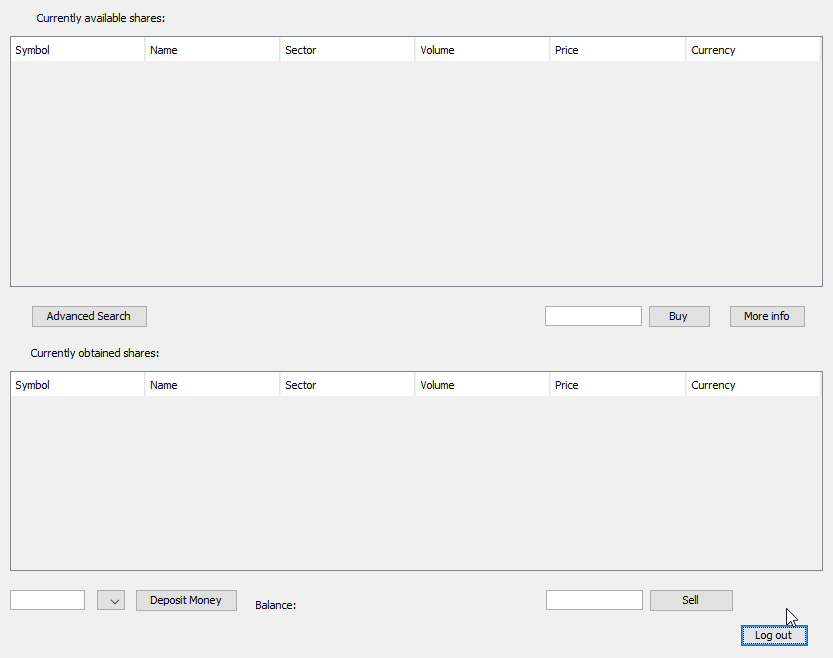

# Shares-Brokering-Service
Shares Brokering Service simulation utilizing a currency conversion system using RESTful APIs for up-to-date shares and currency prices.

Build using Java SOAP Web Services

**Dependencies:** 
- H2 Embedded SQL Database

**Usage: **
- Start the server
- Connect with the client
- Register
- Log in

User Interface screenshot

